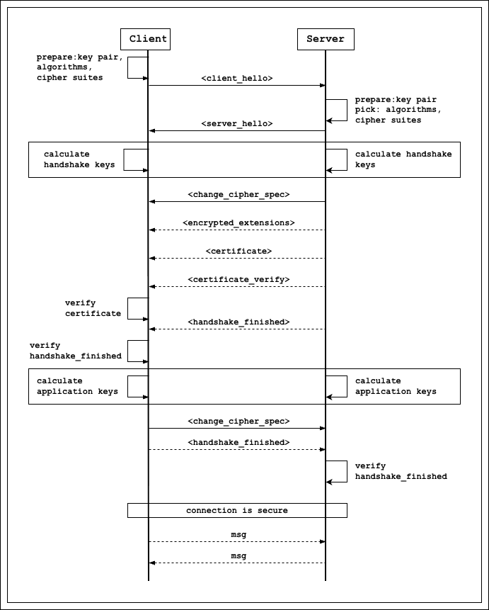

TLS (Transport Layer Security) is the additional layer laid immediately above the socket and below the application layer in TCP/UDP protocol. It's laid there to encrypt and decrypt messages passed through to make sure no one in the mdidle could see the actual message.

We know that if server and client want to hide and read the messages, they should have the same key to encrypt and decrypt (symmetric encryption). But how both ends can securely share the key through insecure network? Let's look at certain steps both ends should go through to make it happended.

# The actual TLS flow

Overrall, the client and server wouldn't share the shared session key through the network, it is calculated by using key exchange algorithms (ECDH, .etc) on key pairs generated by client and server to generate base secret and then using key derivation algorithms (HKDF, .etc) to derive more keys. The decision behind generating many keys is for preventing keys leak.

To prove that the server who client is talking to is authenticated, the certificate is provided by the server. This certificate is signed by an trusted authority. 

One interesting point is the calculated keys are also based on the hash which is generated by hashing all the decrypted messages so far.

The application keys is calculated the same way with handshake keys. These keys are used for encrypt and decrypt message onward.

# More on this
If the message to return to client is large, it will be splited into chunks. As experiment, those chunks are about 1400KB.

Client and server also keep track of how many messages have been encrypted and decryped so far. This value is used in the encrypt/decrypt process. As far as I understand, this is for preventing producing the same encrypted value if one of the ends send the same message again.

There is a definition about the session ticket, I didn't deep dive into this concept. As far as I understand, after the client and server get done on handshake, the server would send the session tickets to client, client can use this data to make another tls session without going through handshake process again. This reduce the network over significantly.

# The end
Beside this notes, I have an implementation to prove what I understand is correct. It is only for educational purpose since I find that the **RFC#8446** is really hard to completely implement.

https://github.com/trieutrng/toy-tls