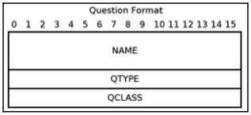
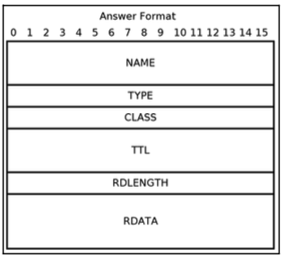

As an engineer in computer industry, everyone should be familiar with the DNS, how a domain is resolved into IP eventually. Yet not everyone understands how the protocol is defined and how the packet is contructed as well. Thus, this post will go through the DNS packet definition and provide an actual implemetation eventually.

# Recall the DNS


DNS is a hierarchical client-server protocol. Every individual domain (e.g., google.com, microsoft.com, etc) is managed by a DNS server which knows where exactly the machine that running the application and eventually return the IP of that machine.

When we register a domain for an IP, we are always being asked to set up some records such as A, AAAA, CNAME, etc,. So what do those records mean?

- **A**: IPv4 address record
- **AAAA**: IPv6 address record
- **MX**: Mail exchange record. This directs mail to an email server
- **TXT**: Text record. This lets an admin store text notes in the record.
- **Canonical name**: Canonical name. This is used to forwards one domain or subdomain to another domain, does NOT provide an IP address.

And so on, you can keep discovering them at [here](https://www.cloudflare.com/learning/dns/dns-records/).
All the end server in the whole flow communicate by the same protocol to resolve exactly the responsible server.

So how the bytes are formed?

# DNS packet structure


First of all, the the packet begins with a header section, this one describes the entire packet, it contains some data and flags like ID, the type of packet (query or answer) and number of questions or answers based on the type. Receiver side will get understood the header and extract the data of the rest later on.

Next, we have the question section, this bunch of bytes store the question of the request which is domain name to be resolved.

The answer bytes holds the tail of the question section, it is built for the response no matter the response belongs to the TLD server or Authoritative one.

For simplicity, the last 2 sections are Authority and Additional will be skipped for this post.

# DNS headers


This section of bytes contains 13 fields:
- **ID**: 16 bits value indicates the ID of the message<br>
- **QR**: 1 bit for the type of message. 0 for query and 1 for response<br>
- **OPCODE**: type of query<br>
- **AA**: Indicates an authoritative answer<br>
- **TC**: Is this message truncated? Then is should be resent using TCP protocol<br>
- **RD**: We leave this bit set to indicate that we
want the DNS server to contact additional servers until it can complete our
request<br>
- **RA**: Indicates in a response whether the DNS server supports recursion<br>
- **Z**: Is unused and should be set to 0<br>
- **RCODE**: The error of the message<br>

<br>
- **QDCOUNT**: Number of question entries<br>
- **ANCOUNT**: Number of answers records<br>
- **NSCOUNT**: Number of records in Authority section<br>
- **ARCOUNT**: Number of records in Additional section<br>

```c
int build_dns_packet(struct Query *query, char *packet) {
    ...

    // ID
    *buf++ = 0xAB; *buf++ = 0xCD; 

    // QR=0,OPCODE=0,AA=0,TC=0,RD=1,RA=0,Z=0,RCODE=0
    *buf++ = 0x01; *buf++ = 0x00; 

    // QDCOUNT = 1
    *buf++ = 0x00; *buf++ = 0x01; 

    // ANCOUNT = 0
    *buf++ = 0x00; *buf++ = 0x00; 

    // QDCOUNT = 0
    *buf++ = 0x00; *buf++ = 0x00; 

    // ARCOUNT = 0
    *buf++ = 0x00; *buf++ = 0x00; 

    ...
}
```

# DNS question


3 fields are described as:
- **NAME**: The querying name that is serialized by a convention<br>
- **QTYPE**: Type of the query<br>

- **QCLASS**: A two octet code that specifies the class of the query. 0x0001 is indicate the Internet address

### Query serialization

The querying domain is specially serialized by some conventions. We first split the domains in to tokens. Each token will be placed into the name section as bytes consecutively and prepended by a 8 bits number which indicates the size of the token. 

For example, the domain www.google.com is splitted in to 3 tokens www, google and com. Then, the encoding will look like this:

| 3 | w | w | w | 6 | g | o | o | g | l | e | 3 | c | o | m | 0 |

The last 0 indicates the end of name.

```c
int build_dns_packet(struct Query *query, char *packet) {
    ...

    char *p_size = buf++, *p_char = query->domain;
    while (*p_char) {
        if (*p_char == '.') {
            *p_size = (buf - p_size - 1);
            p_size = buf;
        } else {
            *buf = *p_char;
        }
        buf++;
        p_char++;
    };

    *p_size = (buf - p_size - 1);
    *buf++ = 0x00;                          // end name
    *buf++ = 0x00; *buf++ = query->type;    // QTYPE
    *buf++ = 0x00; *buf++ = 0x01;           // QCLASS = 1, internet

    ...
}
```

# DNS answer


The 3 fields NAME, TYPE, CLASS have the same format with the questions sections. There are 3 more new fields:
- **TTL**: The time the results can be cached as seconds<br>
- **RDLENGTH**: Length of RDATA field<br>
- **RDATA**: Data's interpretation is dependent upon the type specified by TYPE

```c
void resolve_dns_response(char *dns_res, int res_size) {
    ...

    unsigned char *name;
    p_ans = get_name(res, p_ans, &name);

    const unsigned int type = (*p_ans << 8) + p_ans[1];
    p_ans += 2;

    const int class = (*p_ans << 8) + p_ans[1];
    p_ans += 2;
    
    const unsigned int ttl = (*p_ans << 24) + (p_ans[1] << 16) + (p_ans[2] << 8) + p_ans[3];
    p_ans += 4;

    const int rdlen = (*p_ans << 8) + p_ans[1];
    p_ans += 2;

    if (rdlen == 4 && type == A) {
        printf("%d.%d.%d.%d\n", p_ans[0], p_ans[1], p_ans[2], p_ans[3]);
    } else if (rdlen == 16 && type == AAAA) {
        int j;
        for (j = 0; j < rdlen; j+=2) {
            printf("%02x%02x", p_ans[j], p_ans[j+1]);
            if (j + 2 < rdlen) printf(":");
        }
    } else if (type == TXT) {
        printf("\tTXT: '%.*s'\n", rdlen-1, p_ans+1);
    }

    ...
}
```

# DNS packet compression
A DNS response is sometimes required to repeat the same name multiple times. In this case, a DNS server may encode a pointer to an earlier name instead of sending the same name multiple times. 

A pointer is indicated by a 16-bit value with the two most significant bits set. The lower 14 bits indicate the pointer value. This 14-bit value specifies the location of the name as an offset from the beginning of the message.

# Transport protocol
By default, DNS uses UDP as default protocol and and DNS query or response should fit well inside one packet. However, if a DNS reponse indicates that the message is truncated, then TCP comes and shines, in this case, we fallback to use TCP to query DNS with the same message format as we do with UDP.

# Conslusion


The implementation is at https://github.com/trieutrng/dns-protocol